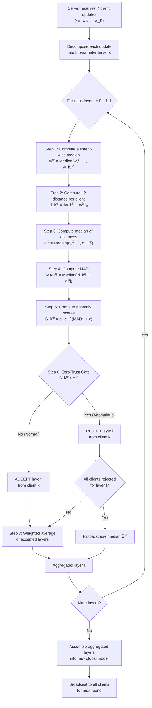

# System Architecture and Methodology

> **Thesis Chapter 3** — Layer-Wise Anomaly Detection for Byzantine-Robust Aggregation in Federated Edge Learning

This document provides a complete description of the system architecture, the threat model, and the proposed L-MAD (Layer-wise Median Absolute Deviation) defence mechanism. The content is intended for direct use in the methodology chapter of the thesis.

---

## Table of Contents

1. [System Overview](#1-system-overview)
2. [Model Architecture](#2-model-architecture)
3. [Data Partitioning](#3-data-partitioning)
4. [Threat Model: Targeted Label-Flipping Attack](#4-threat-model-targeted-label-flipping-attack)
5. [The L-MAD Defence Mechanism](#5-the-l-mad-defence-mechanism)
6. [Mathematical Grounding](#6-mathematical-grounding)
7. [Aggregation Pipeline Flowchart](#7-aggregation-pipeline-flowchart)
8. [Key Innovation: Layer-Granularity Filtering](#8-key-innovation-layer-granularity-filtering)
9. [Flower Framework Integration](#9-flower-framework-integration)

---

## 1. System Overview

The simulation models a Federated Edge Learning network consisting of $K = 10$ clients coordinated by a central parameter server. Of these, 7 clients are *honest* (they train on unmodified data) and 3 are *Byzantine* (they execute a targeted data-poisoning attack before training). The system operates over the CIFAR-10 image classification benchmark using a lightweight convolutional neural network (`SimpleCNN`).

Training proceeds in synchronous *federated rounds*. In each round:

1. The server broadcasts the current global model parameters to all $K$ clients.
2. Each client trains on its local data partition for one epoch and returns its updated weight tensors.
3. The server aggregates the received updates using either the baseline FedAvg strategy or the proposed FedLMAD strategy, producing a new global model.
4. The server evaluates the aggregated model on the full CIFAR-10 test set (10,000 images) and records accuracy and loss.

The entire pipeline is implemented using the Flower (`flwr`) federated learning framework, which manages client–server communication, serialisation of model parameters (as NumPy arrays), and simulation via Ray.

---

## 2. Model Architecture

The `SimpleCNN` is a lightweight four-layer convolutional neural network designed for CIFAR-10 classification ($32 \times 32 \times 3$ RGB images, 10 classes).

| Layer | Type | Configuration | Output Shape |
|---|---|---|---|
| Block 1 | Conv2d → ReLU → MaxPool | 3→32 channels, 3×3 kernel, pad=1, pool 2×2 | $(32, 16, 16)$ |
| Block 2 | Conv2d → ReLU → MaxPool | 32→64 channels, 3×3 kernel, pad=1, pool 2×2 | $(64, 8, 8)$ |
| Flatten | — | $64 \times 8 \times 8 = 4096$ features | $(4096,)$ |
| FC1 | Linear → ReLU → Dropout(0.5) | 4096 → 512 | $(512,)$ |
| FC2 | Linear | 512 → 10 | $(10,)$ |

The network uses `padding=1` in each convolutional layer to preserve spatial dimensions before pooling. After two $2 \times 2$ max-pool operations, the spatial extent reduces from $32 \to 16 \to 8$, yielding a flattened feature vector of 4,096 elements. Dropout ($p = 0.5$) is applied before the output layer as regularisation. The output produces raw logits; softmax is applied internally by `CrossEntropyLoss`.

This architecture was chosen for fast iteration during simulation. Because Flower operates on raw NumPy weight arrays, the model can be substituted (e.g., for ResNet-18) without modifying the federated pipeline.

The model has the following parameter tensors (layers), which are the units of analysis in the L-MAD filter:

| Index $l$ | Parameter Tensor | Shape | Parameters |
|---|---|---|---|
| 0 | `conv1.weight` | $(32, 3, 3, 3)$ | 864 |
| 1 | `conv1.bias` | $(32,)$ | 32 |
| 2 | `conv2.weight` | $(64, 32, 3, 3)$ | 18,432 |
| 3 | `conv2.bias` | $(64,)$ | 64 |
| 4 | `fc1.weight` | $(512, 4096)$ | 2,097,152 |
| 5 | `fc1.bias` | $(512,)$ | 512 |
| 6 | `fc2.weight` | $(10, 512)$ | 5,120 |
| 7 | `fc2.bias` | $(10,)$ | 10 |
| | **Total** | | **2,122,186** |

---

## 3. Data Partitioning

The CIFAR-10 training set (50,000 images) is partitioned into $K = 10$ equal, non-overlapping IID shards of 5,000 samples each, using simple index slicing:

$$
\mathcal{D}_k = \{ x_i : i \in [k \cdot 5000, \; (k+1) \cdot 5000) \}
$$

All clients receive an identically distributed (IID) subset of the data. This is a standard baseline before introducing non-IID heterogeneity experiments. The test set (10,000 images) is shared across all clients and the server for consistent evaluation.

Standard CIFAR-10 normalisation is applied per channel:

$$
\hat{x}_c = \frac{x_c - \mu_c}{\sigma_c}, \quad \mu = (0.4914, 0.4822, 0.4465), \quad \sigma = (0.2470, 0.2435, 0.2616)
$$

---

## 4. Threat Model: Targeted Label-Flipping Attack

### 4.1 Attack Description

The adversary controls a subset of federated clients ($M = 3$ out of $K = 10$, i.e., a **30% compromise ratio**). Each malicious client executes a *targeted label-flipping attack*: before local training begins, all training samples belonging to the source class **Dog** (CIFAR-10 class index 5) are re-labelled as the target class **Cat** (class index 3).

$$
y_i' = \begin{cases} 3 \; (\text{Cat}) & \text{if } y_i = 5 \; (\text{Dog}) \\ y_i & \text{otherwise} \end{cases}
$$

### 4.2 Attack Rationale

Dogs and Cats share significant visual features — fur texture, ear shapes, eye structure. This makes the label-flipping attack particularly *stealthy*: the poisoned gradient direction (learning to classify dogs as cats) is geometrically closer to the honest gradient direction than a semantically distant flip (e.g., Airplane → Frog). The attack is therefore harder for distance-based defences to detect, making it the standard "hard-case" benchmark in the Byzantine-robust FL literature.

### 4.3 Implementation Details

The attack is implemented in `FlowerMaliciousClient.__init__()`, which is structurally identical to the honest client except for a label modification step during initialisation:

1. The client loads its CIFAR-10 partition via `load_data()` (same IID split as honest clients).
2. It accesses the underlying `Dataset.targets` list through the `Subset` wrapper.
3. It iterates over **only the indices belonging to its own partition** and flips every Dog label to Cat.
4. Training then proceeds *honestly* on the poisoned data using standard SGD — the bias enters through the corrupted labels, not through any modification of the optimisation process.

### 4.4 Key Insight

The malicious client is *protocol-compliant*. It faithfully follows the Flower communication protocol, returns properly formatted weight updates, and reports accurate metadata (number of training samples, loss values). From the server's perspective, the poisoned update is indistinguishable from an honest update without inspecting the raw data — which the server never has access to in Federated Learning. This is what makes data-poisoning attacks fundamentally dangerous and motivates the need for robust aggregation strategies like L-MAD.

---

## 5. The L-MAD Defence Mechanism

### 5.1 Design Philosophy

Standard Federated Averaging (FedAvg) computes a weighted mean of all client updates:

$$
w_{\text{global}} = \frac{\sum_{k=1}^{K} n_k \cdot w_k}{\sum_{k=1}^{K} n_k}
$$

where $n_k$ is the number of training samples on client $k$. This gives every client — honest or malicious — equal-per-sample influence. Under the label-flipping attack, the 3 malicious clients contribute poisoned weight updates that steer the global model toward Dog → Cat confusion.

Existing Byzantine-robust aggregation methods (Krum, Coordinate-wise Median, Trimmed Mean) typically operate at the **whole-client level**: an entire client update is either accepted or rejected based on a single aggregate score. This discards *all* layers of a flagged client, even those that may be perfectly honest.

**L-MAD introduces layer-granularity filtering.** Each parameter tensor (weight matrix or bias vector) of each client is independently scored against the population consensus. A client whose convolutional layers are honest but whose final classifier layer is poisoned will only have the classifier layer rejected — the benign convolutional updates are still aggregated. This preserves more useful information and is especially valuable when:

- Only certain layers are affected by the attack (as in label-flipping, which primarily distorts the classifier head).
- Clients have heterogeneous data distributions, causing natural statistical divergence that should not be penalised.

### 5.2 The L-MAD Pipeline

The L-MAD filter is applied independently to each of the $L$ parameter tensors in the model. For a given layer $l$ across $K$ clients:

---

**Step 1 — Layer-wise Median (Robust Centre):**

Compute the element-wise median of layer $l$ across all $K$ clients. This serves as the robust reference point — unlike the mean, the median is resilient to outlier contamination.

$$
\tilde{w}^{(l)} = \text{Median}\!\left(w_1^{(l)},\; w_2^{(l)},\; \ldots,\; w_K^{(l)}\right)
$$

where the median is taken element-wise over the weight tensors.

---

**Step 2 — L2 Distance (Deviation from Consensus):**

Compute the Euclidean (L2) distance between each client's layer weights and the median:

$$
d_k^{(l)} = \left\| w_k^{(l)} - \tilde{w}^{(l)} \right\|_2
$$

A large $d_k^{(l)}$ indicates that client $k$'s update for layer $l$ deviates significantly from what most clients agreed on.

---

**Step 3 — Median of Distances (Expected Deviation):**

Compute the median of the $K$ distances:

$$
\tilde{d}^{(l)} = \text{Median}\!\left(d_1^{(l)},\; d_2^{(l)},\; \ldots,\; d_K^{(l)}\right)
$$

This represents the "typical" distance a client is expected to be from the consensus.

---

**Step 4 — MAD (Robust Spread Estimator):**

Compute the Median Absolute Deviation of the distances:

$$
\text{MAD}^{(l)} = \text{Median}\!\left(\left|d_1^{(l)} - \tilde{d}^{(l)}\right|,\; \ldots,\; \left|d_K^{(l)} - \tilde{d}^{(l)}\right|\right)
$$

MAD is a robust measure of the spread of the distances. Unlike standard deviation, it is not inflated by a single extreme outlier. A MAD near zero indicates high consensus (all clients have similar distances to the median).

---

**Step 5 — Anomaly Score (Normalised Deviation):**

Normalise each client's distance by the MAD:

$$
S_k^{(l)} = \frac{d_k^{(l)}}{\text{MAD}^{(l)} + \epsilon}
$$

where $\epsilon = 10^{-10}$ is a small constant for numerical stability (prevents division by zero when $\text{MAD}^{(l)} = 0$, i.e., perfect consensus). A high anomaly score means the client is anomalously far from the consensus *relative to the expected spread*.

---

**Step 6 — Zero-Trust Gate (Accept / Reject):**

Apply the threshold $\tau$ to determine whether layer $l$ of client $k$ is accepted or rejected:

$$
\text{Gate}_k^{(l)} = \begin{cases} \text{accept} & \text{if } S_k^{(l)} \leq \tau \\ \text{reject} & \text{if } S_k^{(l)} > \tau \end{cases}
$$

The default $\tau = 3.0$ is analogous to a "3-sigma" rule in classical statistics, but using the robust MAD instead of standard deviation.

---

**Step 7 — Weighted Aggregation of Accepted Layers:**

For each layer $l$, aggregate only the accepted clients using weighted averaging (the same weighting scheme as FedAvg, proportional to dataset size):

$$
w_{\text{agg}}^{(l)} = \frac{\sum_{k \in \mathcal{A}^{(l)}} n_k \cdot w_k^{(l)}}{\sum_{k \in \mathcal{A}^{(l)}} n_k}
$$

where $\mathcal{A}^{(l)} = \{ k : S_k^{(l)} \leq \tau \}$ is the set of accepted clients for layer $l$.

**Edge Case — Full Rejection Fallback:**

If all $K$ clients are rejected for a given layer ($\mathcal{A}^{(l)} = \emptyset$), the aggregation falls back to the element-wise median:

$$
w_{\text{agg}}^{(l)} = \tilde{w}^{(l)} = \text{Median}\!\left(w_1^{(l)},\; \ldots,\; w_K^{(l)}\right)
$$

This ensures the strategy always produces a valid model, even under extreme attack scenarios.

---

## 6. Mathematical Grounding

The complete L-MAD pipeline can be expressed as a single composite function. For each layer $l \in \{0, 1, \ldots, L-1\}$ and client $k \in \{1, \ldots, K\}$:

$$
\boxed{
\begin{aligned}
\tilde{w}^{(l)} &= \text{Median}\!\left(w_1^{(l)}, \ldots, w_K^{(l)}\right) \\[6pt]
d_k^{(l)} &= \left\| w_k^{(l)} - \tilde{w}^{(l)} \right\|_2 \\[6pt]
\tilde{d}^{(l)} &= \text{Median}\!\left(d_1^{(l)}, \ldots, d_K^{(l)}\right) \\[6pt]
\text{MAD}^{(l)} &= \text{Median}\!\left(\left|d_1^{(l)} - \tilde{d}^{(l)}\right|, \ldots, \left|d_K^{(l)} - \tilde{d}^{(l)}\right|\right) \\[6pt]
S_k^{(l)} &= \frac{d_k^{(l)}}{\text{MAD}^{(l)} + \epsilon} \\[6pt]
w_{\text{agg}}^{(l)} &= \begin{cases}
\displaystyle\frac{\sum_{k:\, S_k^{(l)} \leq \tau} n_k \, w_k^{(l)}}{\sum_{k:\, S_k^{(l)} \leq \tau} n_k} & \text{if } \mathcal{A}^{(l)} \neq \emptyset \\[10pt]
\tilde{w}^{(l)} & \text{if } \mathcal{A}^{(l)} = \emptyset
\end{cases}
\end{aligned}
}
$$

where:
- $K$ is the number of participating clients
- $L$ is the number of parameter tensors in the model
- $n_k$ is the number of training samples on client $k$
- $\tau = 3.0$ is the anomaly score threshold (configurable)
- $\epsilon = 10^{-10}$ ensures numerical stability
- $\mathcal{A}^{(l)} = \{k : S_k^{(l)} \leq \tau\}$ is the accepted set for layer $l$

---

## 7. Aggregation Pipeline Flowchart

The following diagram illustrates the complete FedLMAD aggregation pipeline executed at the server in each federated round.



---

## 8. Key Innovation: Layer-Granularity Filtering

The diagram below contrasts the conventional whole-client rejection approach with L-MAD's layer-wise approach.

**Scenario:** A malicious client has honest convolutional layers (Blocks 1–2) but poisoned classifier layers (FC1, FC2) due to a label-flipping attack.

| Approach | conv1 | conv2 | fc1 | fc2 | Information Preserved |
|---|---|---|---|---|---|
| **Whole-Client Rejection** (Krum, Trimmed Mean) | ❌ Rejected | ❌ Rejected | ❌ Rejected | ❌ Rejected | 0% — all layers discarded |
| **L-MAD (Layer-wise)** | ✅ Accepted | ✅ Accepted | ❌ Rejected | ❌ Rejected | ~50% — honest conv layers preserved |

In label-flipping attacks, the poisoning effect is most concentrated in the final classifier layers (`fc2.weight`, `fc2.bias`), because those layers directly map features to class predictions. The earlier convolutional layers, which learn generic visual features (edges, textures, shapes), are less affected. L-MAD exploits this structural property of neural networks to maximise the utility of each client's update.

This is particularly valuable when:

- **The attack is layer-localised:** Label-flipping primarily distorts the decision boundary encoded in the classifier head, not the feature extraction layers.
- **Data heterogeneity is present:** In non-IID settings, honest clients may exhibit naturally high variance in certain layers. Whole-client rejection would unfairly penalise them; L-MAD only rejects the specific layers that deviate beyond the statistical threshold.
- **The Byzantine ratio is high:** When many clients are compromised, preserving partial information from each client becomes critical for maintaining model utility.

---

## 9. Flower Framework Integration

`FedLMAD` is implemented as a subclass of Flower's `FedAvg` strategy. Only the `aggregate_fit()` method is overridden — all other strategy behaviour is inherited unchanged:

| Method | Source | Behaviour |
|---|---|---|
| `configure_fit()` | Inherited from FedAvg | Selects clients for each round (100% participation) |
| `configure_evaluate()` | Inherited from FedAvg | Configures evaluation rounds |
| **`aggregate_fit()`** | **Overridden by FedLMAD** | **L-MAD filtering + weighted aggregation** |
| `aggregate_evaluate()` | Inherited from FedAvg | Aggregates client evaluation metrics |
| `evaluate()` | Inherited from FedAvg | Runs centralized evaluation via `evaluate_fn` |
| `initialize_parameters()` | Inherited from FedAvg | Provides initial model weights |

This design makes FedLMAD a **drop-in replacement** for FedAvg in any Flower pipeline. Switching between the two strategies requires only changing the strategy object passed to the simulation; no modifications to client code, communication protocols, or evaluation logic are needed.

### Constructor Parameters

```python
FedLMAD(
    tau=3.0,        # Anomaly score threshold (τ)
    epsilon=1e-10,  # Numerical stability constant (ε)
    **kwargs        # All FedAvg parameters (fraction_fit, min_fit_clients, etc.)
)
```

### Metrics Emitted

After each aggregation round, `aggregate_fit()` returns the following metrics (accessible via Flower's `History` object):

| Metric Key | Type | Description |
|---|---|---|
| `lmad_total_rejections` | `int` | Total layer-level rejections across all clients and layers |
| `lmad_num_clients` | `int` | Number of participating clients ($K$) |
| `lmad_num_layers` | `int` | Number of parameter tensors ($L$) |
| `lmad_layer_{l}_rejections` | `int` | Number of clients rejected for layer $l$ |
